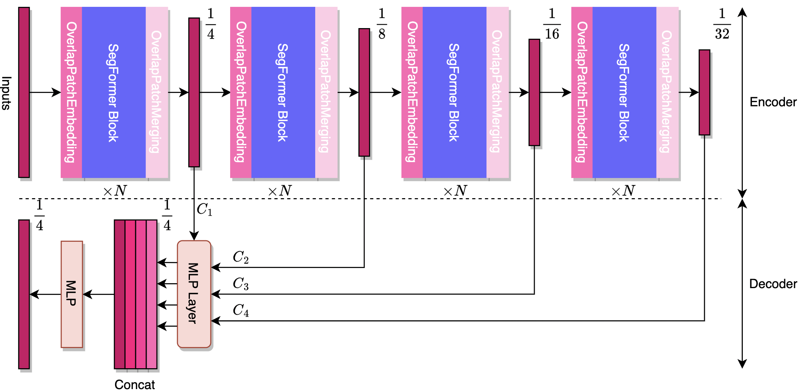

# An Overview of Segformer and Details Description
In this repository, the structure of the <b>Segformer</b> model is explained. In many recent blog posts and tutorials, the structure of Segformer has been misunderstood by many people, even experienced computer vision engineers, for reasons that may include misleading diagrams of the Segformer structure in the [original paper](https://arxiv.org/pdf/2105.15203.pdf), but the model structure is shown clearly in the [source code address](https://github.com/NVlabs/SegFormer) given in the paper. Therefore, the details of the Segformer, including <b>OverlapPatchEmbedding</b>, <b>Efficient Multihead Attention</b>, <b>Mixed-FeedForward Network</b>, <b>OverlapPatchMerging</b> and <b>Segformer block</b>, will also be elaborated here. If there is any problem, please feel free to make a complain, also make a [contact](hzhang205@sheffield.ac.uk) if convenient.<br>
Also, the model has been uploaded for a reference which is developed by Keras/TensorFlow.
## Basics and File Description
Project cloning:

```
git clone https://github.com/ACSEkevin/An-Overview-of-Segformer-and-Details-Description.git
```

`ADEChallengeData2016/`: ADE20K, the dataset has been used for training and testing the model, please refer to: [ADE20K Dataset](https://github.com/CSAILVision/ADE20K).<br>
`models/`: Two types of programming the model: <b>structrual</b>  and <b>class inheritance</b>.<br>
`adedataset.py`: a dataset batch generator (keras requirement).<br>
`train.py`: model train script.<br>

## A General Overview of the Model Arcitecture
Here a <b>re-drawn</b> architecture replaces the one from the [original paper](https://arxiv.org/pdf/2105.15203.pdf), which might help to gain a better understanding.
<p align='center'>  

</p>

To conclude and compare:
* In encoder, an input image is scaled to its $\frac{1}{32}$ and then upsampled to $\frac{1}{4}$ of the original size in decoder. However, the model given in the repository upsampled to the <b>full size</b> to attempt for a better result. This can be revised after cloning.
* In the original figure, <b>OverlapPatchEmbedding</b> layer is only shown at the begining of the architecture, which can be misleading, infact, there is always <b>OverlapPatchEmbedding</b> layers followed by previous transformer block (shown as SegFormer Block in the figure). Nevertheless, the paper presents a plural term as `OverlapPatchEmbeddings' which implies that there more than one layer.
* There is a <b>OverlapPatchMerging</b> layer at the end of the transformer block, this layer reshapes the vector groups back to feature maps. It can be easy to confuse these two layers as many blogs shows a `no-merging-after-block' opinion.
* The feature map $C_1$ goes through the <b>MLP Layer</b> without upsampling. Others are upsampled by $\times 2, \times 4, \times 8$ respectively with <b>bilinear</b> interpolation.


## A Single Stage of the Architecture
### OverlapPatchEmbedding
In basic trabsformer block, an image is split and patched as a 'sequence', there is no info interaction between patches (strides=patch_size). While in Segformer, the patch size > strides which leads to information sharing between patches (each conv row) thus called 'overlapped' patches. In the end, followed by a layer normalization.

```python
from keras.layers import *
import tensorflow as tf
x = Conv2D(n_filters, kernel_size=kernel_size, strides=strides, padding='same')(inputs)
batches, height, width, embed_dim = x.shape
x = tf.reshape(x, shape=[-1, height * width, embed_dim])
x = LayerNormalization()(x)
```

### A Segformer Block
Below is a diagram that shows the detailed architecture of an <b>A Segformer Block</b> module. A sequence goes through `Efficient Self-Attention` and
`Mix-Feedforward Network` layers, each preceded by a `Layer Normalization`.
<p align='center'>  

</p>

In the [paper](https://arxiv.org/pdf/2105.15203.pdf), the authors proposed an <b>Efficient Self-Attention</b> to reduce the temporal complexity from $O(n^2)$ to $O(\frac{n^2}{sr})$ where $sr$ is sampling reduction ratio. The module trans back to basic <b>Self-Attention</b> $sr=1$. <p>
<b>Efficient Self-Attention</b>:
* Like a normal Self-Attention module, each vector of an input sequence will propose $query$, $key$ and $value$. While there is only one vector shown in the figure.
* Differently, $key$ and $value$ matrices go through `reduction` layer then participate in transformations. The layer can be implemented by `Conv2D` which plays a role of down sampling (strides $=$ kernel_size), then followed by a `Layer Normalization`. The `Reshape` layers helps reconstruct and de-construct feature maps respectively.
* Shape changes in <b>reduction</b> layer: $[num_{patches}, dim_{embed}]$ -> $[height, width, dim_{embed}]$ -> $[\frac{height}{sr}, \frac{width}{sr}, dim_{embed}]$ -> $[\frac{height \times width}{sr^2}, dim_{embed}]$.

<b>Mix-Feedforward Network</b>:
[Condtional Positional Encoding](https://arxiv.org/abs/2102.10882) method addresses the problem of loss of accuracy resulted from different input resolutions in VisionTransformer. In this [paper](https://arxiv.org/pdf/2105.15203.pdf) authors pointed out that positional encoding(PE) is not necessary for segmentation tasks. Thus there is only a `Conv` $3 \times 3$ layer without PE in `Mix-FFN`. 
* In the [code](https://github.com/NVlabs/SegFormer), the `Conv2D` was adopted, whereas, the layer was named after <b>DWConv</b> , which can be can be mis-considered Depth-wise conv layer. It is also important to notice that this conv layer does not change the resolution, dimension of the input feature size.
* The `Reshape` layers have the same purpose as those in `reduction` layer from <b>Efficient Self-Attention</b>.
* Shape changes in <b>Mix-FFN</b> layer: $[num_{patches}, dim_{embed}]$ -> $[num_{patches}, dim_{embed} \cdot rate_{exp}]$ -> $[[height, width, dim_{embed} \cdot rate_{exp}]$ -> $[num_{patches}, dim_{embed} \cdot rate_{exp}]$ -> $[num_{patches}, dim_{embed}]$.


### To Be Continued

